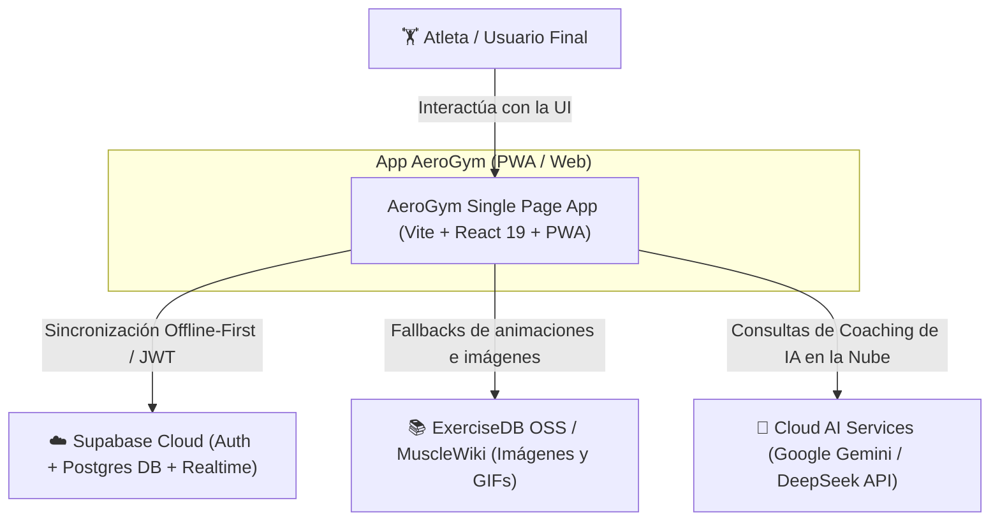
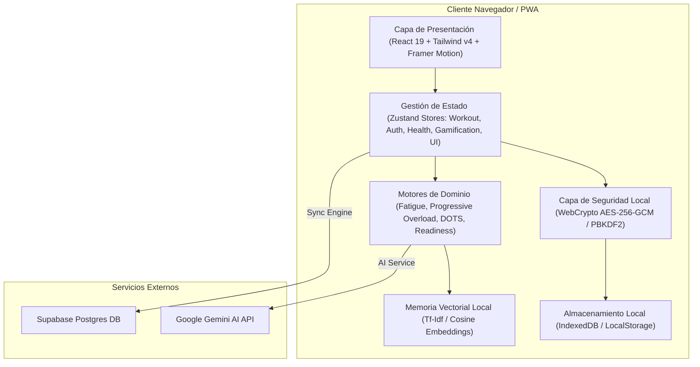
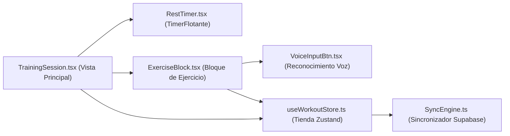

# Documentación de Arquitectura — Modelo C4 AeroGym 2.0 / 3.0

**Versión**: 2.0.0 Enterprise  
**Fecha**: Julio 2026  
**Estatus**: Producción  

---

## Level 1: System Context Diagram (Contexto del Sistema)

El siguiente diagrama ilustra la interacción del usuario final con AeroGym, las bases de datos externas de la comunidad y los servicios de Inteligencia Artificial (Gemini API, DeepSeek) y sincronización con Supabase Cloud.

---

## Level 2: Container Diagram (Diagrama de Contenedores)

Muestra la arquitectura interna de la PWA del cliente, el almacenamiento local cifrado en navegador y las capas de soporte.

---

## Level 3: Component Diagram (Diagrama de Componentes - Entrenamiento)

Detalle de los componentes que orquestan una sesión de entrenamiento activa y la persistencia local/remota.

---

## Level 4: Code Level Patterns & SOLID Guidelines

- **Single Responsibility Principle (SRP)**:
  - Vistas (`views/`) se encargan exclusivamente de la orquestación y navegación.
  - Motores (`lib/*Engine.ts`) son funciones puras o clases sin dependencias del DOM ni de React.
  - Componentes (`components/`) renderizan fragmentos UI reutilizables.
- **Open/Closed Principle (OCP)**:
  - Los motores de sobrecarga progresiva (`progressiveOverloadEngine.ts`) y fatiga (`fatigueEngine.ts`) permiten añadir nuevas estrategias de cálculo sin alterar la interfaz de consumo.
- **Dependency Inversion Principle (DIP)**:
  - `SyncEngine.ts` implementa la abstracción de persistencia remota sobre la base de datos Supabase Postgres.
